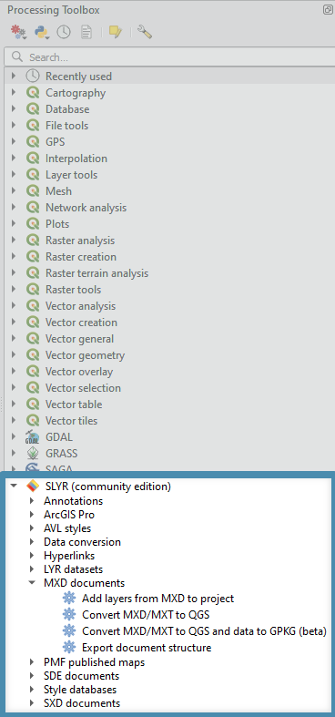
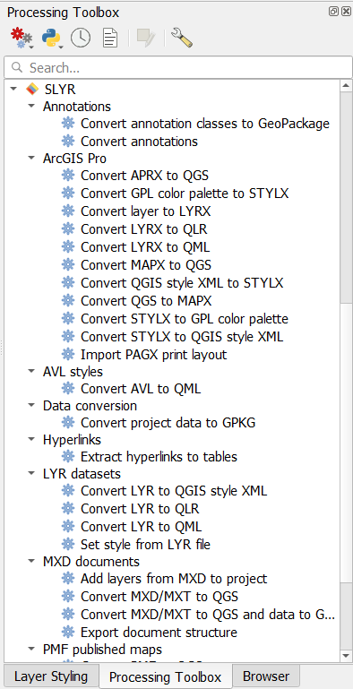

# Installing SLYR

SLYR is available in two versions. Depending on whether you are using the 
community edition or the full-feature licensed edition, the installation
process varies.

## Installing **SLYR (Community Edition)**

To install the **SLYR (Community Edition)**, open the **Plugin Manager**, click
on the top menu item `Plugins` ▶️ `Manage and Install Plugins`.

In the dialog that opens, type *SLYR* in the search bar.

In the middle panel, click on the *SLYR (Community Edition)*  and then click
on `Install Plugin`.

The Plugin Manager will then run the Install for you. When the install has
completed, click on `Close`.

> Any further updates to the SLYR plugin will be available to you within the
> Plugin Manager.

The **SLYR (Community Edition)** will appear in the browser panel. Expand the
tools and start using them.

> The **SLYR (Community Edition)** has limited tools - check
> the [SLYR Blog](https://north-road.com/slyr/) for availability as we update
> tool accessibility once we have reached our funding goals.
> A tool will return an error if it is only available in the fully licenced **SLYR**.

## Installing SLYR (licensed version)

Once purchased, licensed users will receive an email from **North Road** with a
link for the installer and their licence key.

**Before installing the licensed version of SLYR, you must first uninstall the
community version (if installed) and restart QGIS.**

1. Save the information in this email, along with your invoice and receipt in a
   safe place for future reference.

2. Download the installer from the link.
    * Place the zip file in a safe location for future reference - just in case
      you need to update your machine so you can reload it.

3. Unzip the downloaded file, and then drag the
   extracted `install_slyr_qgis.py` over an open **QGIS** window. (If prompted,
   accept the warning regarding trusted scripts). The script will add a
   connection to the private plugins repository, and install the **SLYR**
   plugin for you.

4. After the plugin is installed, the **SLYR** `Options` dialog will open (If
   it doesn't, click on the top menu `Settings` ▶️ `Options` and click on *
   *SLYR** in the left panel). Enter your unique license key at this screen,
   exactly as it appears at the end of this email. Enter the optional
   requirements outlined in
   the [SLYR Options section](/user_guide/setting_up_slyr_options).

5. Once installed, **SLYR** will appear in the browser panel. Expand the tools
   and start using them.

