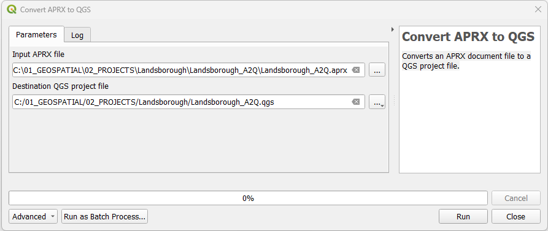

# SLYR Tools #

## Before you start ##
We like things tidy, don't we? So here is a checklist to help your conversions and working swithin **SLYR** just work a little bit smoother.

> ✔️ **Populate settings requirements:**  Check out the **SLYR Options** on the [For Full Licence Users](https://slyr.north-road.com/user_guide/setup_slyr) page. 
>
> ✔️ **Set up your folders:**  **SLYR** will record the pathways from the original data locations, so there is no need to have a special set-up. However, you may want set-up a structure so you can keep outputs tidy. 
>
> ✔️ **Access to files:**  Files: .svg, fonts, images
>
> ✔️ **Geodatabase settings:**  Indexes sometimes cause issues with conversions if they are broken or there is something non-standard in its structure. Check [Troubleshooting](https://slyr.north-road.com/user_guide/troubleshooting){:target="_blank" rel="noopener"}_ for the workaround. 
> 
> ✔️ **Geopackages:** ArcGIS Pro and Geopackages has not yet reached full support. Therefore an error will be produced if you are exporting from a geopackage. e.g. *Warning: Railway: Converting .gpkg layers is not yet fully supported, layer path has been replaced with a dummy shapefile path*. See the [Troubleshooting](https://slyr.north-road.com/user_guide/troubleshooting)for the workaround.
> 
> ✔️ **Symbology:**  If you are using rule-based renderers, these are not yet available in ArcGIS Pro. See the [Limitations](https://slyr.north-road.com/user_guide/limitations). 
> 
> ✔️ **Error Messages:**   If a tool returns an error saying it is not available, if you are using the Community Edition, it may not yet be available. Otherwise check the [Troubleshooting](https://slyr.north-road.com/user_guide/troubleshooting) page. 

<!---## Group ##
### Tool ###
| From | To |
| ---- | ---|
| **ESRI** .aprx | **QGIS** .qgs, .qgz | 

Description

1. Instruction.
2. Instruction.

> This tool is available only with the SLYR full licence.

*See also:* --->
---
## ArcGIS Pro ##
### Convert APRX to QGS ###
| From | To |
| ---- | ---|
| **ESRI** .aprx | **QGIS** .qgs, .qgz | 

Converts an APRX document file to a QGS project file.

1. In the **QGIS** `Processing Toolbox` Click on `SLYR` ▶️ `ArcGIS Pro` ▶️ `Convert APRX to QGS`.
2. In the `Input APRX file`, browse to the location of the *.arpx* file.
3. Under `Destination QGS project file`, set the location of the *.qgs* file.
4. Click `OK`. 
> If errors are returned, read through the `Log`, rectify the issues and rerun the tool.
6. Once processed, in **QGIS**, navigate to the folder and open the *.qgs* file.

> This tool is available only with the SLYR full licence.

### Convert GPL color palette to STYLX ###
| From | To |
| ---- | ---|
| **ESRI** .aprx | **QGIS** .qgs, .qgz | 

Description

1. Instruction.
2. Instruction.

> This tool is available only with the SLYR full licence.
### Convert QGIS to MAPX ###

| From | To |
| ---- | ---|
| **QGIS** .qgz, qgs | **ESRI ArcGIS Pro** .mapx |

Converts a **QGIS** project to a *.mapx*. A *.mapx* is an ESRI map file format used in their software **ArcGIS Pro**. It's function is to enable sharing of maps, recording all the elements drawn in the ArcGIS Pro .aprx. 

1. In the **QGIS** `Processing Toolbox` Click on `SLYR` ▶️ `ArcGIS Pro` ▶️ `Convert QGIS to MAPX`.
2. In the `Input QGIS file`, browse to the location of the *.qgs* or *.qgz* file.
3. Under `Destination MAPX project file`, set the location of the *.mapx* file.
4. Click `OK`. 
> If errors are returned, read through the `Log`, rectify the issues and rerun the tool.
6. Once processed, in **ArcGIS Pro**, navigate via the `Catalog` and open the *.mapx* file.

> Available only with the SLYR full licence.

> Can be run as a batch tool 

