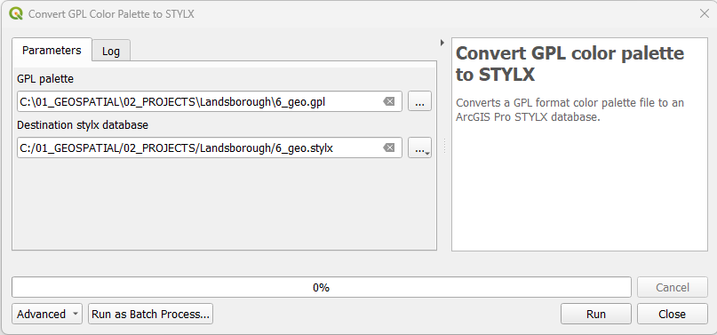
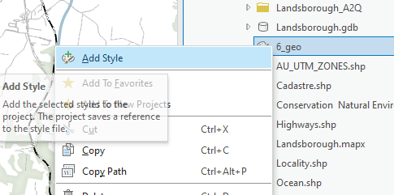
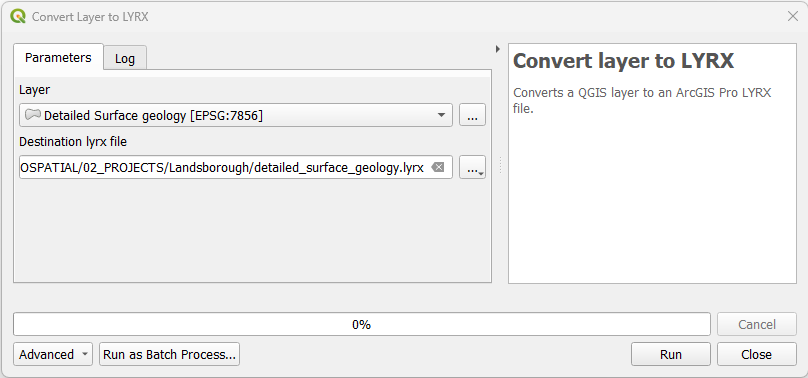
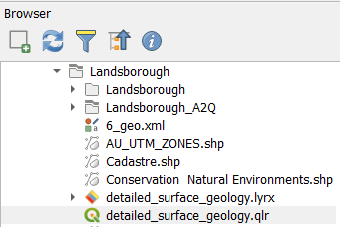
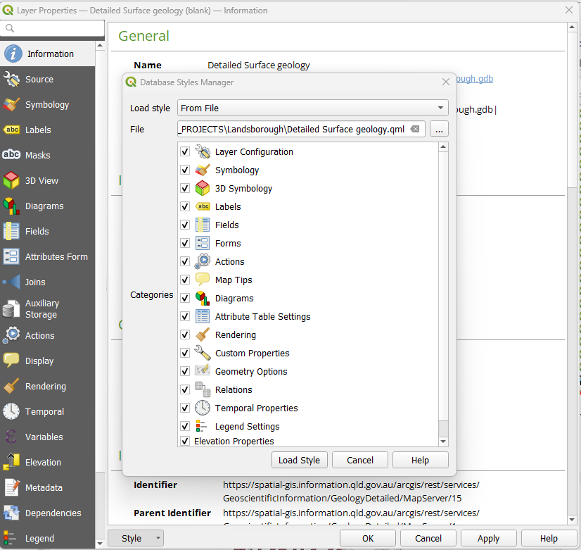
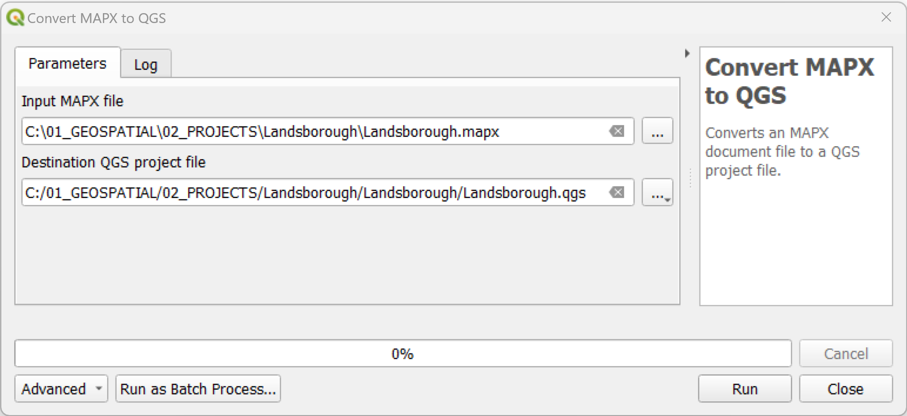

# SLYR Tools #

## Before you start ##
Here is a checklist to help your conversions and workings with **SLYR** run a little bit smoother.

> ✔️ **Populate settings requirements:**  set-up the **SLYR Options** following these [guidelines](https://slyr.north-road.com/user_guide/setup_slyr).
>
> ✔️ **Set up your folders:**  **SLYR** will record the pathways from the original data locations, so there is no need to have a special set-up. However, you may want to set-up a structure so you can keep outputs tidy. 
>
> ✔️ **Access to files:**  ensure you have access to bespoke files such .svg, fonts, and images. Note that there is some [limitations](https://slyr.north-road.com/user_guide/limitations) with QGIS Svg files.
> 
> ✔️ **Geopackages:** ArcGIS Pro and Geopackages has not yet reached full support. Therefore an error will be produced if you are exporting from a geopackage.   
>   
>      Warning: Railway: Converting .gpkg layers is not yet fully supported, layer path has been replaced with a dummy shapefile path.
>   - See [Troubleshooting](https://slyr.north-road.com/user_guide/troubleshooting) for the workaround.
> 
> ✔️ **Symbology:**  If you are using rule-based renderers, these are not yet available in ArcGIS Pro. See the [Limitations](https://slyr.north-road.com/user_guide/limitations). 
> 
> ✔️ **Error Messages:**   If a tool returns an error:
  > - Saying it is not available, if you are using the Community Edition, it may not yet be available. 
  > - All other errors, read through the `Log`, check the [Troubleshooting](https://slyr.north-road.com/user_guide/troubleshooting) page on how to recitfy the issue and rerun the tool. If there is no recitifcation, please [email us](mailto:info@north-road.com).
*** 

<!---## Group ##
### Tool ###
| From | To |
| ---- | ---|
| **ESRI** .aprx | **QGIS** .qgs, .qgz | 

Description

1. In the **QGIS** `Processing Toolbox` Click on `SLYR` ▶️ `ArcGIS Pro` ▶️ `X`.
2. In the `Input X`, browse to the location of the *.X* file.
3. Under `Destination X`, set the location of the *.X* file.

> This tool is available only with the SLYR full licence.
***
--->
## INCOMPLETE Annotations ## ****this is currently not working***** THINKING IT MAY ONLY WORK FROM ARCMAP and NOT ArcGIS Pro********
<!---### Convert annotation classes to GeoPackage ###
| From | To |
| ---- | ---|
| **ESRI** .gdp | **QGIS** .gpkg | 
???can it add to a geopackage or dos it create a gpkg each time????
This tool will take an annotation class currently saved in a geodatabase and convert it into a geopackage layer. 

1. In the **QGIS** `Processing Toolbox` Click on `SLYR` ▶️ `Annotations` ▶️ `Convert annotation classes to GeoPackage`.
2. In the `Input Geodatabase`, browse to the location of the annotation file.
3. Under `Output GeoPackage`, set the location of the *.gpkg* file.

> This tool is available only with the SLYR full licence.
***

### Convert Annotations ###
| From | To |
| ---- | ---|
| **ESRI** annotation layer | **QGIS** ? annotation layer | 

Description

1. In the **QGIS** `Processing Toolbox` Click on `SLYR` ▶️ `Annotations` ▶️ `Convert annotations`.
2. In the `Input layer`, browse to the location of the *.X* file.
3. Under `Element field`, select which field contains the label text from the dropdown.
4. Click `Run`.
???not sure what happens then???

> This tool is available only with the SLYR full licence.
***
--->
## ArcGIS Pro ##
### Convert APRX to QGS ###
| From | To |
| ---- | ---|
| **ESRI** .aprx | **QGIS** .qgs, .qgz | 

Converts an APRX document file to a QGS project file.

1. In the **QGIS** `Processing Toolbox` Click on `SLYR` ▶️ `ArcGIS Pro` ▶️ `Convert APRX to QGS`.
2. In the `Input APRX file`, browse to the location of the *.arpx* file.
3. Under `Destination QGS project file`, set the location of the *.qgs* file.
4. Click `Run`. 
5. Once processed, in **QGIS**, navigate to the folder and open the *.qgs* file.

> This tool is available only with the SLYR full licence.
***
### Convert GPL color palette to STYLX ###
| From | To |
| ---- | ---|
| .gpl| **ESRI** .stylx | 

GPL color palettes can be created in graphics programs such as GIMP and Inkscape and are useful for carefully curated palettes. **SLYR** converts it into a **ArcGIS Pro** .stylx format that can then be imported into your **ArcGIS Pro** styles. 

1. In the **QGIS** `Processing Toolbox` Click on `SLYR` ▶️ `ArcGIS Pro` ▶️ `Convert GPL color palette to STYLX`.
2. Under the `GPL palette`, browse to the location of the *.gpl* file.
3. Under `Destination stylx database`, set the location of the *.X* file.
4. In **ArcGIS Pro**, in the `Catalog` panel, right mouse click on the *.stylx* file and select `Add Style`.

6. In `Geoprocessing`, 

> This tool is available only with the SLYR full licence.
***
### Convert layer to LYRX ###
| From | To |
| ---- | ---|
| **QGIS** layer | **ESRI** .lyrx | 

Once you have set up your symbology on your layer, **SLYR** will extract the symbology out from the layer and convert it to a ArcGIS Pro LYRX file that can be applied to data in ArcGIS Pro.

1. In **QGIS**, ensure the layer containing the symbology for exporting is loaded.  
2. In the `Processing Toolbox` Click on `SLYR` ▶️ `ArcGIS Pro` ▶️ `Convert layer to LYRX`.
3. Under `Layer`, select the layer.
4. Under `Destination lyrx file`, set the location of the *.lyrx* file.
5. Click `Run`.
6. Once processed, in **ArcGIS Pro**, navigate via the `Catalog` and open the *.lyrx* file.

> This tool is available only with the SLYR full licence.
***
### Convert LYRX to QLR ###
| From | To |
| ---- | ---|
| **ESRI** .lyrx | **QGIS** .qlr | 

Converts an ArcGIS Pro LYRX file to a QGIS QLR file. Both of these files act similarly and will reach back to the original data file. 

1. In the **QGIS** `Processing Toolbox` Click on `SLYR` ▶️ `ArcGIS Pro` ▶️ `Convert LYRX to QLR`.
2. In the `Input LYRX file`, browse to the location of the *.lyrx* file.
3. Choose to store relative paths - this will impact on the performance of the QLR if the data is removed from the specified location.
4. Under `Destination QLR file`, set the location of the *.qlr* file.
5. Click `Run`
6. Once processed, you can drag and drop the *.qlr* file from the **QGIS** `Browser` into your map. 

> This tool is available only with the SLYR full licence.
***
### Convert LYRX to QML ###
| From | To |
| ---- | ---|
| **ESRI** .lyrx | **QGIS** .qml | 

Converts an ArcGIS Pro LYRX file to a QGIS QML file. If multiple layers are present in the LYRX file, each will be converted to an individual QML file.

1. In the **QGIS** `Processing Toolbox` Click on `SLYR` ▶️ `ArcGIS Pro` ▶️ `Convert LYRX to QML`.
2. In the `Input LYRX file`, browse to the location of the *.lyrx* file.
3. Under `Destination QML file`, set the location of the *.qml* file.
    > If more than one layer exists in the **lyrx** file, a qml will be produced for each
    > 

5. Once processed, load the **.qml** files via the `Layer Properties`.

> This tool is available only with the SLYR full licence.
***
### Convert MAPX to QGS ###
| From | To |
| ---- | ---|
| **ESRI** .mapx | **QGIS** .qgs | 

Converts an MAPX document file to a QGS project file.

1. Save your **ArcGIS Pro** file then export your map out as a *.mapx* file. 
2. In the **QGIS** `Processing Toolbox` Click on `SLYR` ▶️ `ArcGIS Pro` ▶️ `Convert MAPX to QGS`.
4. In the `Input MAPX file`, browse to the location of the *.mapx* file.
5. Under `Destination QGS project file`, set the location of the *.qgs* file to the same **ArcGIS Pro** project folder (hint: where the .aprx is stored).
6. Click 'Run'.
7. Open up the *.qgs* file and check through. 
    >In some cases, labels do not automatically turn on. Note that labelling parameters are saved, it just needs to be manually turned on.
    
8. Save your project as *.qgz* if requried.

> This tool is available only with the SLYR full licence.
***
### Convert QGIS to MAPX ###
| From | To |
| ---- | ---|
| **QGIS** .qgz, qgs | **ESRI ArcGIS Pro** .mapx |

Converts a **QGIS** project to a *.mapx*. A *.mapx* is an ESRI map file format used in their software **ArcGIS Pro**. It's function is to enable sharing of maps, recording all the elements drawn in the ArcGIS Pro .aprx. 

1. In the **QGIS** `Processing Toolbox` Click on `SLYR` ▶️ `ArcGIS Pro` ▶️ `Convert QGIS to MAPX`.
2. In the `Input QGIS file`, browse to the location of the *.qgs* or *.qgz* file.
3. Under `Destination MAPX project file`, set the location of the *.mapx* file.
4. Click `OK`. 
    > If errors are returned, read through the `Log`, rectify the issues and rerun the tool.

6. Once processed, in **ArcGIS Pro**, navigate via the `Catalog` and open the *.mapx* file.

> Available only with the SLYR full licence.
> Can be run as a batch tool 
***
