# SLYR Tools #

## Before you start ##
Here is a checklist to help your conversions and workings with **SLYR** run a little bit smoother.

> ✔️ **Populate settings requirements:**  set-up the **SLYR Options** following these [guidelines](https://slyr.north-road.com/user_guide/setup_slyr).
>
> ✔️ **Set up your folders:**  **SLYR** will record the pathways from the original data locations, so there is no need to have a special set-up. However, you may want to set-up a structure so you can keep outputs tidy. 
>
> ✔️ **Access to files:**  ensure you have access to bespoke files such .svg, fonts, and images. Note that there is some [limitations](https://slyr.north-road.com/user_guide/limitations) with QGIS Svg files.
> 
> ✔️ **Geopackages:** ArcGIS Pro and Geopackages has not yet reached full support. Therefore an error will be produced if you are exporting from a geopackage.   
>   
>      Warning: Railway: Converting .gpkg layers is not yet fully supported, layer path has been replaced with a dummy shapefile path.
>   - See [Troubleshooting](https://slyr.north-road.com/user_guide/troubleshooting) for the workaround.
> 
> ✔️ **Symbology:**  If you are using rule-based renderers, these are not yet available in ArcGIS Pro. See the [Limitations](https://slyr.north-road.com/user_guide/limitations). 
> 
> ✔️ **Error Messages:**   If a tool returns an error:
  > - Saying it is not available, if you are using the Community Edition, it may not yet be available. 
  > - All other errors, read through the `Log`, check the [Troubleshooting](https://slyr.north-road.com/user_guide/troubleshooting) page on how to recitfy the issue and rerun the tool. If there is no recitifcation, please [email us](mailto:info@north-road.com).
*** 

<!---## Group ##
### Tool ###
| From | To |
| ---- | ---|
| **ESRI** .aprx | **QGIS** .qgs, .qgz | 

Description

1. In the **QGIS** `Processing Toolbox` Click on `SLYR` ▶️ `Group` ▶️ `X`.
2. In the `Input X`, browse to the location of the *.X* file.
3. Under `Destination X`, set the location of the *.X* file.
4. Click `Run`.

> This tool is available only with the SLYR full licence.
***
--->
## INCOMPLETE Annotations ## ****this is currently not working***** THINKING IT MAY ONLY WORK FROM ARCMAP and NOT ArcGIS Pro********
<!---### Convert annotation classes to GeoPackage ###
| From | To |
| ---- | ---|
| **ESRI** .gdp | **QGIS** .gpkg | 
???can it add to a geopackage or dos it create a gpkg each time????
This tool will take an annotation class currently saved in a geodatabase and convert it into a geopackage layer. 
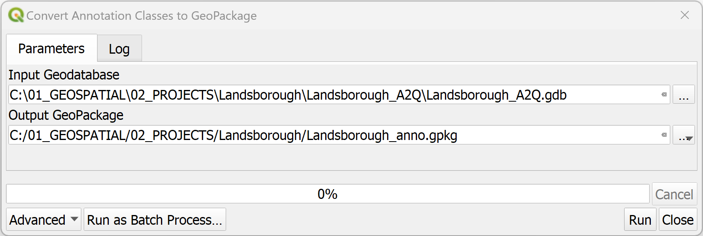
1. In the **QGIS** `Processing Toolbox` Click on `SLYR` ▶️ `Annotations` ▶️ `Convert annotation classes to GeoPackage`.
2. In the `Input Geodatabase`, browse to the location of the annotation file.
3. Under `Output GeoPackage`, set the location of the *.gpkg* file.

> This tool is available only with the SLYR full licence.
***

### Convert Annotations ###
| From | To |
| ---- | ---|
| **ESRI** annotation layer | **QGIS** ? annotation layer | 

Description

1. In the **QGIS** `Processing Toolbox` Click on `SLYR` ▶️ `Annotations` ▶️ `Convert annotations`.
2. In the `Input layer`, browse to the location of the *.X* file.
3. Under `Element field`, select which field contains the label text from the dropdown.
4. Click `Run`.
???not sure what happens then???

> This tool is available only with the SLYR full licence.
***
--->
## ArcGIS Pro ##
### Convert APRX to QGS ###
| From | To |
| ---- | ---|
| **ESRI** .aprx | **QGIS** .qgs, .qgz | 

Converts an APRX document file to a QGS project file.

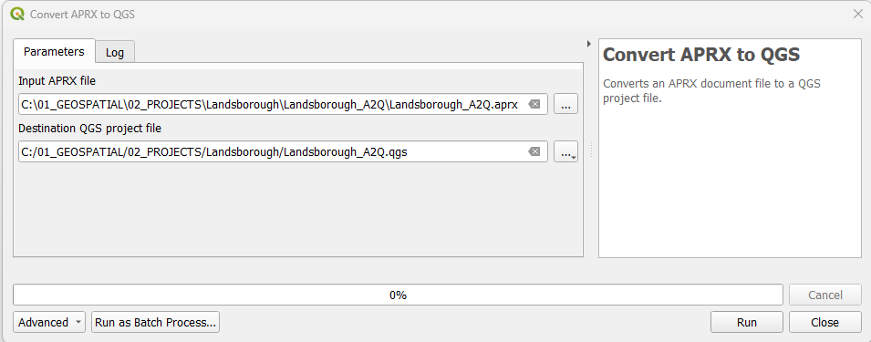
1. In the **QGIS** `Processing Toolbox` Click on `SLYR` ▶️ `ArcGIS Pro` ▶️ `Convert APRX to QGS`.
2. In the `Input APRX file`, browse to the location of the *.arpx* file.
3. Under `Destination QGS project file`, set the location of the *.qgs* file.
4. Click `Run`. 
5. Once processed, in **QGIS**, navigate to the folder and open the *.qgs* file.

> This tool is available only with the SLYR full licence.
***
### Convert QGS to APRX ###
| From | To |
| ---- | ---|
| **QGIS** .qgs, .qgz | **ESRI** .aprx |

Converts a QGIS project file to an APRX file.

1. In the **QGIS** `Processing Toolbox` Click on `SLYR` ▶️ `ArcGIS Pro` ▶️ `Convert APRX to QGS`.
2. In the `Input QGS file`, browse to the location of the *.qgz* file.
3. Under `Destination APRX project file`, set the location of the *.aprx* file.

> Current limitations with geopackages
>   `warnings: Warning: Rail Stations: Converting .gpkg layers is not yet fully supported, layer path has been replaced with a dummy shapefile path`
> In ArcGIS Pro, this will require each layer to be repathed. However, if you undertake this in the `Map view`, the style will be lost.
> To keep a layer's style, use the `Update Data Sources' tool in the `Catalog` view

> This tool is available only with the SLYR full licence.
***
### Convert GPL color palette to STYLX ###
| From | To |
| ---- | ---|
| .gpl| **ESRI** .stylx | 

GPL color palettes can be created in graphics programs such as GIMP and Inkscape and are useful for carefully curated palettes. **SLYR** converts it into a **ArcGIS Pro** .stylx format that can then be imported into your **ArcGIS Pro** styles. 

1. In the **QGIS** `Processing Toolbox` Click on `SLYR` ▶️ `ArcGIS Pro` ▶️ `Convert GPL color palette to STYLX`.
2. Under the `GPL palette`, browse to the location of the *.gpl* file.
3. Under `Destination stylx database`, set the location of the *.X* file.
4. In **ArcGIS Pro**, in the `Catalog` panel, right mouse click on the *.stylx* file and select `Add Style`.

6. In `Geoprocessing`, 

> This tool is available only with the SLYR full licence.
***
### Convert layer to LYRX ###
| From | To |
| ---- | ---|
| **QGIS** layer | **ESRI** .lyrx | 

Once you have set up your symbology on your layer, **SLYR** will extract the symbology out from the layer and convert it to a ArcGIS Pro LYRX file that can be applied to data in ArcGIS Pro.

1. In **QGIS**, ensure the layer containing the symbology for exporting is loaded.  
2. In the `Processing Toolbox` Click on `SLYR` ▶️ `ArcGIS Pro` ▶️ `Convert layer to LYRX`.
3. Under `Layer`, select the layer.
4. Under `Destination lyrx file`, set the location of the *.lyrx* file.
5. Click `Run`.
6. Once processed, in **ArcGIS Pro**, navigate via the `Catalog` and open the *.lyrx* file.

> This tool is available only with the SLYR full licence.
***
### Convert LYRX to QLR ###
| From | To |
| ---- | ---|
| **ESRI** .lyrx | **QGIS** .qlr | 

Converts an ArcGIS Pro LYRX file to a QGIS QLR file. Both of these files act similarly and will reach back to the original data file. 

1. In the **QGIS** `Processing Toolbox` Click on `SLYR` ▶️ `ArcGIS Pro` ▶️ `Convert LYRX to QLR`.
2. In the `Input LYRX file`, browse to the location of the *.lyrx* file.
3. Choose to store relative paths - this will impact on the performance of the QLR if the data is removed from the specified location.
4. Under `Destination QLR file`, set the location of the *.qlr* file.
5. Click `Run`
6. Once processed, you can drag and drop the *.qlr* file from the **QGIS** `Browser` into your map. 

> This tool is available only with the SLYR full licence.
***
### Convert LYRX to QML ###
| From | To |
| ---- | ---|
| **ESRI** .lyrx | **QGIS** .qml | 

Converts an ArcGIS Pro LYRX file to a QGIS QML file. If multiple layers are present in the LYRX file, each will be converted to an individual QML file.

1. In the **QGIS** `Processing Toolbox` Click on `SLYR` ▶️ `ArcGIS Pro` ▶️ `Convert LYRX to QML`.
2. In the `Input LYRX file`, browse to the location of the *.lyrx* file.
3. Under `Destination QML file`, set the location of the *.qml* file.
    > If more than one layer exists in the **lyrx** file, a qml will be produced for each
    > 

5. Once processed, load the **.qml** files via the `Layer Properties`.

> This tool is available only with the SLYR full licence.
***
### Convert LYRX to SLD ###
| From | To |
| ---- | ---|
| **ESRI** .lyr/.lyrx | **QGIS** .sld | 

Converts ESRI LYR or LYRX files to the "SLD" format (Styled Layer Descriptor). This feature simplifies the process of sharing and utilizing symbology between different GIS software, allowing for direct conversion of ESRI symbology for use in Geoserver or Mapserver. 

1. In the **QGIS** `Processing Toolbox` Click on `SLYR` ▶️ `ArcGIS Pro` ▶️ `Convert LYRX to QML`.
2. In the `Input LYRX file`, browse to the location of the *.lyrx* file.
3. Under `Destination QML file`, set the location of the *.qml* file.
    > If more than one layer exists in the **lyrx** file, a qml will be produced for each
    > 

5. Once processed, load the **.qml** files via the `Layer Properties`.

> This tool is available only with the SLYR full licence.
***
### Convert MAPX to QGS ###
| From | To |
| ---- | ---|
| **ESRI** .mapx | **QGIS** .qgs | 

Converts an MAPX document file to a QGS project file.

1. Save your **ArcGIS Pro** file then export your map out as a *.mapx* file. 
2. In the **QGIS** `Processing Toolbox` Click on `SLYR` ▶️ `ArcGIS Pro` ▶️ `Convert MAPX to QGS`.
4. In the `Input MAPX file`, browse to the location of the *.mapx* file.
5. Under `Destination QGS project file`, set the location of the *.qgs* file to the same **ArcGIS Pro** project folder (hint: where the .aprx is stored).
    > Note due to 
7. Click 'Run'.
8. Open up the *.qgs* file and check through. 
    >In some cases, labels do not automatically turn on. Note that labelling parameters are saved, it just needs to be manually turned on.
    
8. Save your project as *.qgz* if requried.

> This tool is available only with the SLYR full licence.
***
### Convert QGIS style XML to STYLX ###
| From | To |
| ---- | ---|
| **QGIS** .xml| **ESRI** .stylx |

Converts a QGIS XML style database to an ArcGIS Pro STYLX database. You will need to create a XML style file. If this has not already been completed, refer to [14.1.1.3 Sharing style items](https://docs.qgis.org/3.28/en/docs/user_manual/style_library/style_manager.html) in **QGIS** documentation. Creating a XML of your styles allows for portability between software and is handy if you have curated a set of styles unique to a project.

1. In the **QGIS** `Processing Toolbox` Click on `SLYR` ▶️ `ArcGIS Pro` ▶️ `Convert QGIS style XML to STYLX`.
2. In the `Style XML`, browse to the location of the *.xml* file.
3. Under `Destination stylx database`, set the location of the *.stylx* file.
4. In **ArcGIS Pro**, in the `Catalog`pane, navigate to the style and right mouse click the file to choose where you wish to save the style to. 

> This tool is available only with the SLYR full licence.
***
### Convert QGIS to MAPX ###
| From | To |
| ---- | ---|
| **QGIS** .qgz, qgs | **ESRI ArcGIS Pro** .mapx |

Converts a **QGIS** project to a *.mapx*. A *.mapx* is an ESRI map file format used in their software **ArcGIS Pro**. It's function is to enable sharing of maps, recording all the elements drawn in the ArcGIS Pro .aprx. 

1. In the **QGIS** `Processing Toolbox` Click on `SLYR` ▶️ `ArcGIS Pro` ▶️ `Convert QGIS to MAPX`.
2. In the `Input QGIS file`, browse to the location of the *.qgs* or *.qgz* file.
3. Under `Destination MAPX project file`, set the location of the *.mapx* file.
4. Click `OK`. 
    > If errors are returned, read through the `Log`, rectify the issues and rerun the tool.

6. Once processed, in **ArcGIS Pro**, navigate via the `Catalog` and open the *.mapx* file.

> Available only with the SLYR full licence.
> Can be run as a batch tool 
***
### Convert STYLX to GPL color palette ###
| From | To |
| ---- | ---|
| **ESRI** .stylx | **QGIS** .gpl | 

Converts an ArcGIS Pro STYLX database to a GPL format color palette file, extracting all color entities saved in the style. GPL color palettes are a file format for GIMP color palettes - [GIMP](https://www.gimp.org/) is a cross-platform image editor available for GNU/Linux, macOS, Windows etc and can be added to your QGIS palette options.

1. In the **QGIS** `Processing Toolbox` Click on `SLYR` ▶️ `ArcGIS Pro` ▶️ `Convert STYLX to GPL color palette`.
2. For `Sytlx database`, browse to the location of the *.stylx* file.
3. Under `Destination GPL file`, set the location of the *.gpl* file.
4. Click on `Run`.
5. Once converted, import via `Settings` ▶️ `Options`▶️ `Color` and ensure you tick `Show in Color Buttons`to access it via the color drop-down function in `Layer Styling`. 

In this example, I have added a Landuse - Natural Environment GPL palette.
 

   

> This tool is available only with the SLYR full licence.
***
### Convert STYLX to QGIS style XML ###
| From | To |
| ---- | ---|
| **ESRI** .stylx | **QGIS** .xml | 

Converts an ArcGIS Pro STYLX database to a QGIS XML Style library. This is particularly useful if your project has a selection of unique symbols that you wish to continue to use. 

1. In the **QGIS** `Processing Toolbox` Click on `SLYR` ▶️ `ArcGIS Pro` ▶️ `Convert STYLX to QGIS style XML`.
2. Under `Stylx database`, browse to the location of the *.stylx* file.
3. Under `Destination XML file`, set the location of the *.xml* file.
4. In 'Uncovertable symbols report [optional]`, enter a location for those symbols that fail to convert. This allows you to create a new vector layer containing details of all unconvertable symbols. This report can be saved as any standard vector format, including Shapefile, XLSX or Geopackage. 
5. Click on `Run`.
6. Once it has converted, you can import the *XML* file via the `Style Manager` ▶️ `Import/Export`.

> This tool is available only with the SLYR full licence.
***
### Import PAGX print layout ###
| From | To |
| ---- | ---|
| **ESRI** .pagx | **QGIS** .qgs, .qgz | 

Imports a PAGX print layout into the current QGIS project.

1. In ArcGIS Pro, make sure you save your layout first, then *share* as a 'Layout file'
2. In the **QGIS** `Processing Toolbox` Click on `SLYR` ▶️ `ArcGIS Pro` ▶️ `Imports a PAGX Print Layout`.
3. In the `Input PAGX file`, browse to the location of the *.pagx* file.
4. Click 'Run'
5. Open up the imported print layout from `Project` ▶️`Layouts`

> This tool is available only with the SLYR full licence.
***
## AVL styles ##
### Convert AVL to QML ###
| From | To |
| ---- | ---|
| **ESRI** .avl | **QGIS** .qml| 

Converts an ESRI ArcInfo AVL file to a QGIS QML file. AVL files were the legend files for Arcview 3.x but have been replaced by layer files. It is no longer possible to create AVL legend files in the last version of ArcMap.

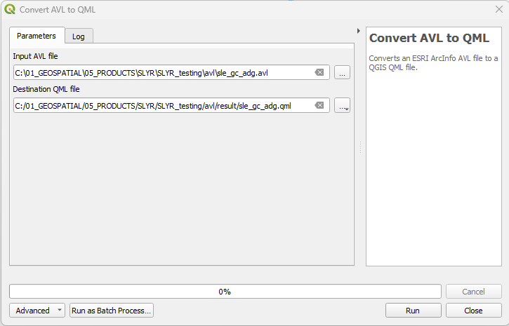

1. In the **QGIS** `Processing Toolbox` Click on `SLYR` ▶️ `AVL styles` ▶️ `Convert AVL to QM`.
2. In the `Input AVL file`, browse to the location of the *.avl* file.
3. Under `Destination QML file`, set the location of the *.qml* file.
4. Click `Run`.

 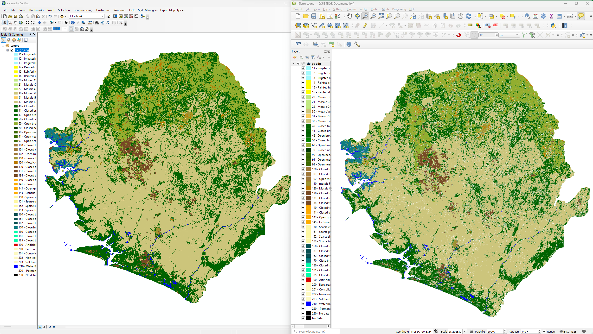
 Conversion of Land cover of Sierra Leone - Globcover Regional (46 classes) (source: [FAO](https://data.apps.fao.org/catalog/iso/973fdcbe-c347-47a7-9af7-e2e57729a35b))
  

> This tool is available only with the SLYR full licence.
***

## Data Conversion ##
**QGIS** [has the capability of creating, reading and managing Geodatabases](https://north-road.com/2022/11/24/qgis-3-28-improvements-for-working-with-esri-formats-and-services/) , therefore conversion is not necessary to keep on working with your data in **QGIS**. Understanding why you want to convert from a geodatabase to a geopackage is important. 
- If you are still going to work alongside **ESRI** software, then the recommendation here is ***not*** to convert it.  
- If you are moving completely to **QGIS**, and just love the extra functionality that geopackages give you, then continue on with the data conversion. 

### Convert File Geodatabase to GeoPackage ###
| From | To |
| ---- | ---|
| **ESRI** .gdb | **OGC** .gpkg | 

Converts all data from an ESRI File Geodatabase to a GeoPackage database.

This tool will convert:
- All vector layers
- Field domains

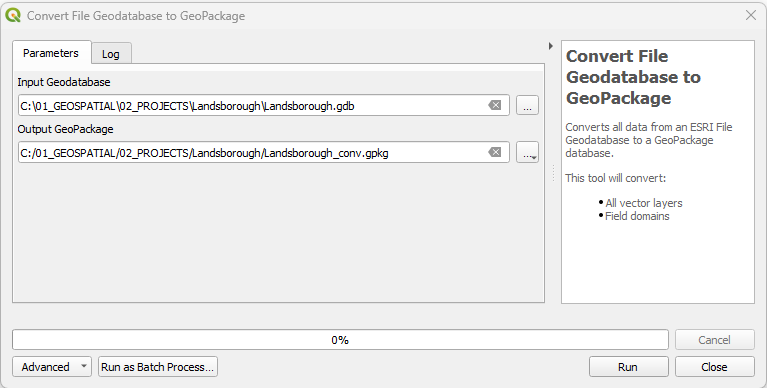

1. In the **QGIS** `Processing Toolbox` Click on `SLYR` ▶️ `Data Conversion` ▶️ `Convert File Geodatabase to GeoPackage`.
2. In the `Input Geodatabase`, browse to the location of the *.gdb* file.
3. Under `Output Geopackage`, set the location of the *.gpkgk* file.
4. Click `Run`.  
   
> This tool is available only with the SLYR full licence.

### Convert project data to GPKG ###
| From | To |
| ---- | ---|
| **QGIS** loaded layers | **OGC** .gpkg | 

Converts all referenced data from the current project to standard formats.

Referenced layer data stored in non-standard formats (such as MDB or GDB files) will be converted to the standard GeoPackage format
in order to create projects and data files which are optimized for use in QGIS and other open-source tools.

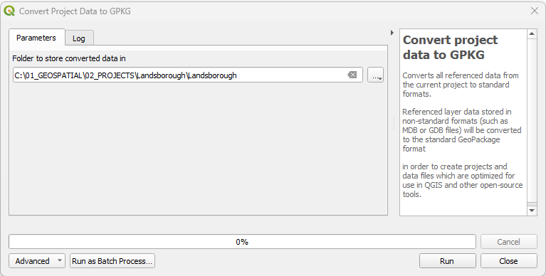

1. In the **QGIS** `Processing Toolbox` Click on `SLYR` ▶️ `Data Conversion` ▶️ `Convert project data to GPKG`.
2. In `Folder to store converted data in`, browse to the location of the folder you wish to store the geopackage in.
3. Click `Run`.  

> This tool is available only with the SLYR full licence.
***

--- tool currently not working
## Hyperlinks ##
### Extract hyperlinks to tables ###
| From | To |
| ---- | ---|
| **ESRI** .mxd/.mxt/.pmf/.lyr | **OGC** .gpkg | 

Extract hyperlinks from layers to standalone tables

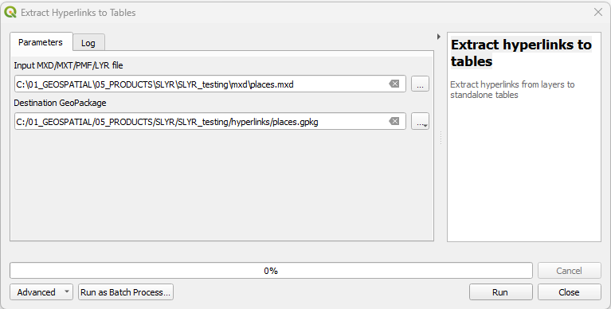

1. In the **QGIS** `Processing Toolbox` Click on `SLYR` ▶️ `Hyperlinks` ▶️ `Extract hyperlinks to tables`.
2. In the `Input .MXD/.MXT/.PMF/.LYR`, browse to the location of the file.
3. Under `Destination Geopackage`, set the location of the *.gpkg* file.
4. Click `Run`.

> This tool is available only with the SLYR full licence.
***

## LYR Datasets ##
### Convert LYR to QGIS style XML ###
| From | To |
| ---- | ---|
| **ESRI** .lyr | **QGIS** .xml | 

Converts an ESRI LYR file to a QGIS style XML file that can be additionally be used in other applications. For QGIS, you can use the XML to load into the style manager, which is handy to port over standardised symbology used in worklows.

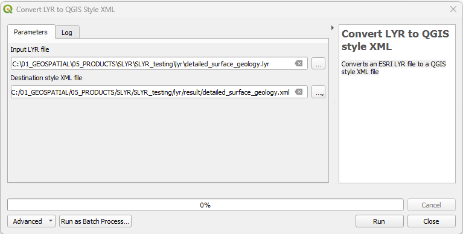

1. In the **QGIS** `Processing Toolbox` Click on `SLYR` ▶️ `LYR Datasets` ▶️ `Convert LYR to QGIS style XML`.
2. In the `Input LYR file`, browse to the location of the *.lyr* file.
3. Under `Destination style XML file`, set the location of the *.xml* file.
4. Click `Run`.

> This tool is available in the Community Edition and with the SLYR full licence.

### Convert LYR to QLR ###
| From | To |
| ---- | ---|
| **ESRI** .lyr | **QGIS** .qlr | 

Converts an ESRI LYR file to a QGIS QLR file. 

1. In the **QGIS** `Processing Toolbox` Click on `SLYR` ▶️ `LYR Datasets` ▶️ `Convert LYR to QLR`.
2. In the `Input LYR file`, browse to the location of the *.lyr* file.
3. Under `Destination QLR file`, set the location of the *.qlr* file.
4. Click `Run`.

> This tool is available in the Community Edition and with the SLYR full licence.

### Convert LYR to QML ###
| From | To |
| ---- | ---|
| **ESRI** .lyr | **QGIS** .qml | 

Converts an ESRI LYR file to a QGIS QML file. If multiple layers are present in the LYR file, each will be converted to an individual QML file.

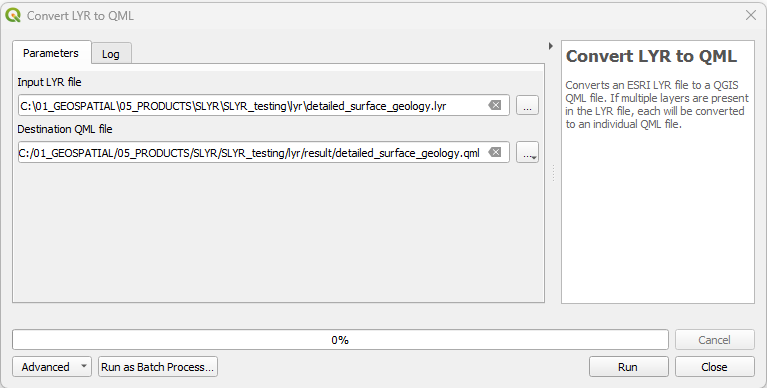

1. In the **QGIS** `Processing Toolbox` Click on `SLYR` ▶️ `LYR Datasets` ▶️ `Convert LYR to QML`.
2. In the `Input LYR file`, browse to the location of the *.lyr* file.
3. Under `Destination QML file`, set the location of the *.qml* file.
4. Click `Run`.

> This tool is available in the Community Edition and with the SLYR full licence.

### Set style from LYR file ###
| From | To |
| ---- | ---|
| **ESRI** .lyr | **QGIS** layer symbology | 

Sets a layer's settings and symbology from an ESRI LYR file.

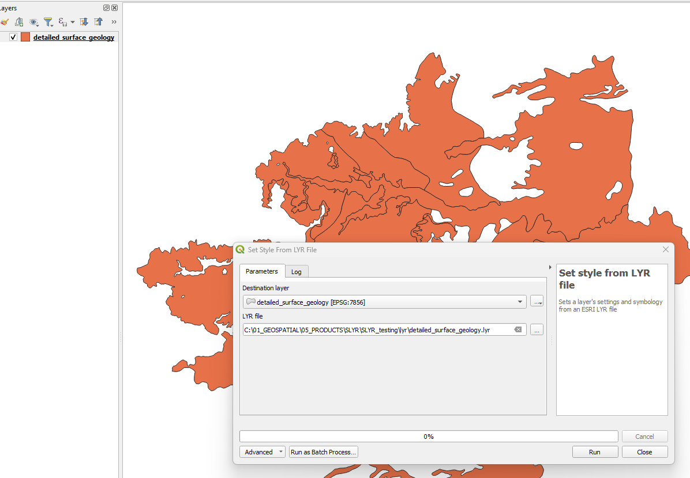

1. In the **QGIS** `Processing Toolbox` Click on `SLYR` ▶️ `LYR Datasets` ▶️ `Set style from LYR file`.
2. In the `Destination layer`, select the layer from the dropdown list. 
3. Under `LYR file`, set the location of the *.lyr* file.
4. Click `Run`.

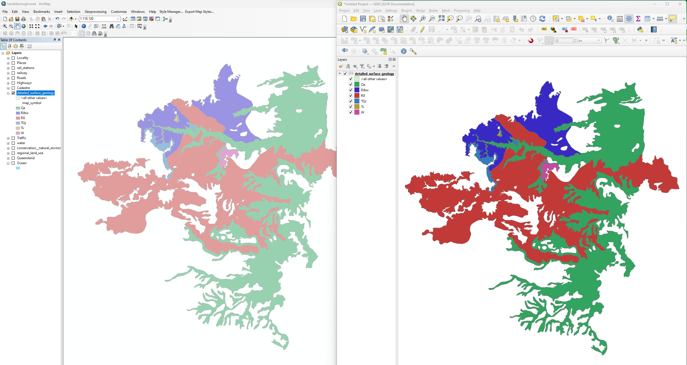
Note that the **ArcMap** symbology has a transparency setting to 50% and that this is not carried over in the LYR settings.  

> This tool is available in the Community Edition and with the SLYR full licence.

***
## MXD documents ##
### Add layers from MXD to project ###
| From | To |
| ---- | ---|
| **ESRI** .mxd | **QGIS** .qgs, .qgz | 

This tool will add layers from an MXD document to the current project, with each layers original symbology, including labels and placement. It won't be automatically saved, so remember to save it once it comes in. The layers will source the data from the original location. This tool could be used to bring in multiple mxds into a single project using the Batch Process tool. 

1. In the **QGIS** `Processing Toolbox` Click on `SLYR` ▶️ `MXD documents` ▶️ `Add layers from MXD to projec`.
2. In the `Input MXD file`, browse to the location of the *.mxd* file.
3. Click `Run`.
4. Save the project to a desired location.

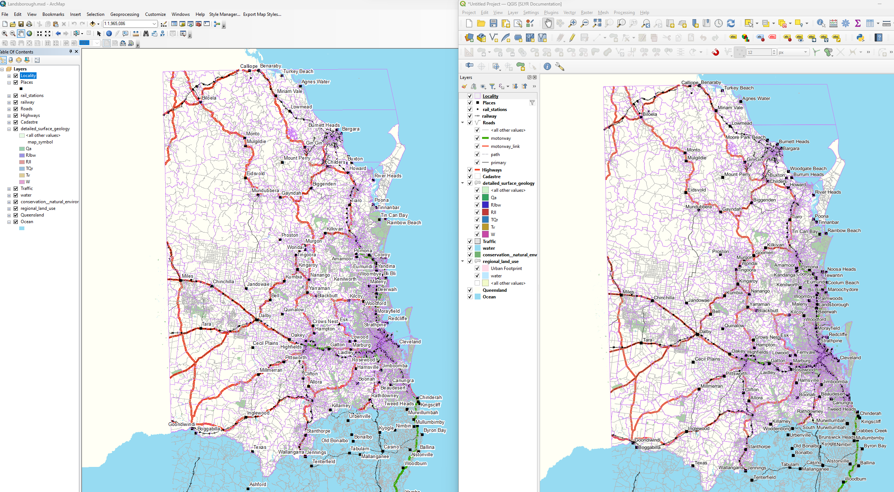

> This tool is available only with the SLYR full licence.

### Convert MXD/MXT to QGS ###
| From | To |
| ---- | ---|
| **ESRI** .mxd | **QGIS** .qgs, .qgz | 

This tool converts an MXD or MXT document file to a QGIS project file. If you wish to save the project to qgz, open the project and click `save as` 

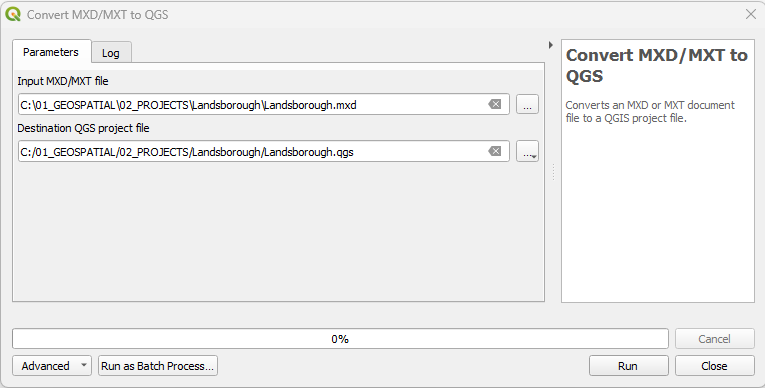

1. In the **QGIS** `Processing Toolbox` Click on `SLYR` ▶️ `MXD documents` ▶️ `Convert MXD/MXT to QGS`.
2. In the `Input MXD/MXT file`, browse to the location of the *.mxd* file.
3. Under `Destination QGS project file`, set the location of the *.qgs* file.
4. Click `Run`.
5. Navigate to the location of the newly created MXD and open it.

> This tool is available only with the SLYR full licence.

### Convert MXD/MXT to QGS and data to GPKG ###
| From | To |
| ---- | ---|
| **ESRI** .mxd | **QGIS** .qgs, .gpkg | 

This tool converts an MXD or MXT document file to a QGIS project file, and converts all referenced data to standard formats.
Referenced layer data stored in non-standard formats (such as MDB or GDB files) will be converted to the standard GeoPackage format in order to create projects which are optimized for use in QGIS and other open-source tools.

1. In the **QGIS** `Processing Toolbox` Click on `SLYR` ▶️ `MXD documents` ▶️ `Convert MXD/MXT to QGS and data to GPKG`.
2. In the `Input MXD/MXT file`, browse to the location of the file.
3. Under `Destination QGS project file`, set the location of the *.qgs* file.
4. Under `Folder to store converted data in` enter in the location for the data.  
5. Click `Run`.

> This tool is available only with the SLYR full licence.

### Export document structure ###
| From | To |
| ---- | ---|
| **ESRI** .mxd | .json | 

This algorithm exports a JSON representation of the internal structure of an ESRI MXD or LYR document file. It is designed for debugging purposes, allowing users to view in-depth detail about the document structure and layer configuration.

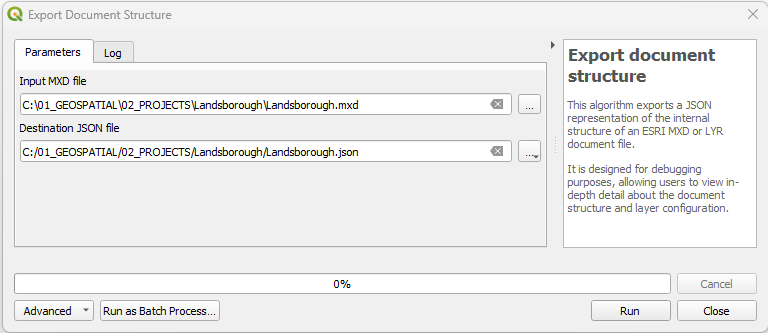

1. In the **QGIS** `Processing Toolbox` Click on `SLYR` ▶️ `MXD documents` ▶️ `Export document structure`.
2. In the `Input MXD file`, browse to the location of the *.mxd* file.
3. Under `Destination JSON file`, set the location of the *.json* file.
4. Click `Run`.
5. Open up the JSON file to inspect the structure.

> This tool is available only with the SLYR full licence.
***
## PMF published maps ##
### Convert PMF to QGS ###
| From | To |
| ---- | ---|
| **ESRI** .pmf | **QGIS** .qgs | 

Description

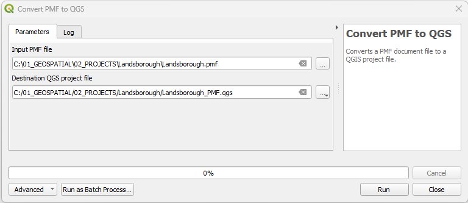

1. In the **QGIS** `Processing Toolbox` Click on `SLYR` ▶️ `PMF published maps` ▶️ `Convert PMF to QGS`.
2. In the `Input PMF file`, browse to the location of the *.pmf* file.
3. Under `Destination QGS project file`, set the location of the *.qgs* file.
4. Click `Run`.

> This tool is available only with the SLYR full licence.
***
## SDE documents ##
### Extract SDE connection details  ###
| From | To |
| ---- | ---|
| **ESRI** .aprx | **QGIS** .qgs, .qgz | 

This algorithm extracts the connection details from a .sde connection file. Optionally, a JSON representation containing these details can be exported.

1. In the **QGIS** `Processing Toolbox` Click on `SLYR` ▶️ `SDE documents` ▶️ `Extract SDE connection details`.
2. In the `Input X`, browse to the location of the *.X* file.
3. Under `Destination X`, set the location of the *.X* file.
4. Click `Run`.

> This tool is available only with the SLYR full licence.
***
