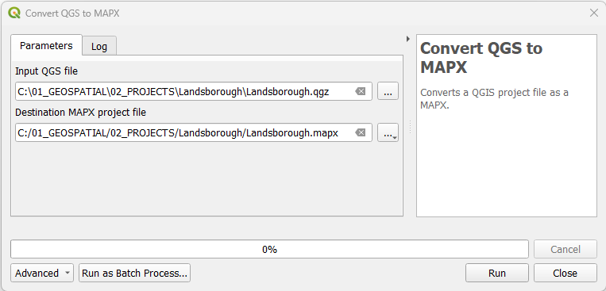

# SLYR Tools #

## Before you start ##
We like things tidy, don't we? So here is a checklist to help your conversions and working swithin **SLYR** just work a little bit smoother.

### Populate settings requirements ###
### Set up your folders ###
### Access to files ###
> Files: .svg, fonts, images
### Geodatabase settings ###
### Geopackages ###
ArcGIS Pro and Geopackages has not yet reached full support. Therefore an error will be produced if you are exporting from a geopackage 
e.g. *Warning: Railway: Converting .gpkg layers is not yet fully supported, layer path has been replaced with a dummy shapefile path*
> See the [Troubleshooting](https://slyr.north-road.com/user_guide/troubleshooting){:target="_blank" rel="noopener"}_ for the workaround
> 
>  If your files are in a geopackage, ArcGIS Pro will not recognise this and the following may happen:
  
  >  The file links will be broken
  
  >  If you repath them to the geopackage, this will impact on the symbology. 

### Symbology ###  
If you are using rule-based renderers, these are not yet available in ArcGIS Pro. 
> Workaround: > See the [Limitations](https://slyr.north-road.com/user_guide/limitations){:target="_blank" rel="noopener"}_ 

## Error Messages ##
> If a tool returns an error saying it is not available:
  > If you are using the Community Edition, it may not yet be available.
  > Check the [Troubleshooting](https://slyr.north-road.com/user_guide/troubleshooting){:target="_blank" rel="noopener"} page.

<!---## Group ##
### Tool ###
| From | To |
| ---- | ---|
| ESRI .mxd | QGIS .qgz | 

Description

1. Instruction.
2. Instruction.

> This tool is available only with the SLYR full licence.

*See also:* --->

## ArcGIS Pro ##
### Convert QGIS to MAPX ###

| From | To |
| ---- | ---|
| **QGIS** .qgz, qgs | **ESRI ArcGIS Pro** .mapx |

Converts a **QGIS** project to a *.mapx*. A *.mapx* is an ESRI map file format used in their software **ArcGIS Pro**. It's function is to enable sharing of maps, recording all the elements drawn in the ArcGIS Pro .aprx. 

1. In the **QGIS** `Processing Toolbox` Click on `SLYR` ▶️ `ArcGIS Pro` ▶️ `Convert QGIS to MAPX`.
2. In the `Input QGIS file`, browse to the location of the *.qgs* or *.qgz* file.
3. Under `Destination MAPX project file`, set the location of the *.mapx* file.
4. Click `OK`. 
> If errors are returned, read through the `Log`, rectify the issues and rerun the tool.
6. Once processed, in **ArcGIS Pro**, navigate to the `Catalog` and open the *.mapx* file.

> Available only with the SLYR full licence.

> Can be run as a batch tool 

*See also:*
